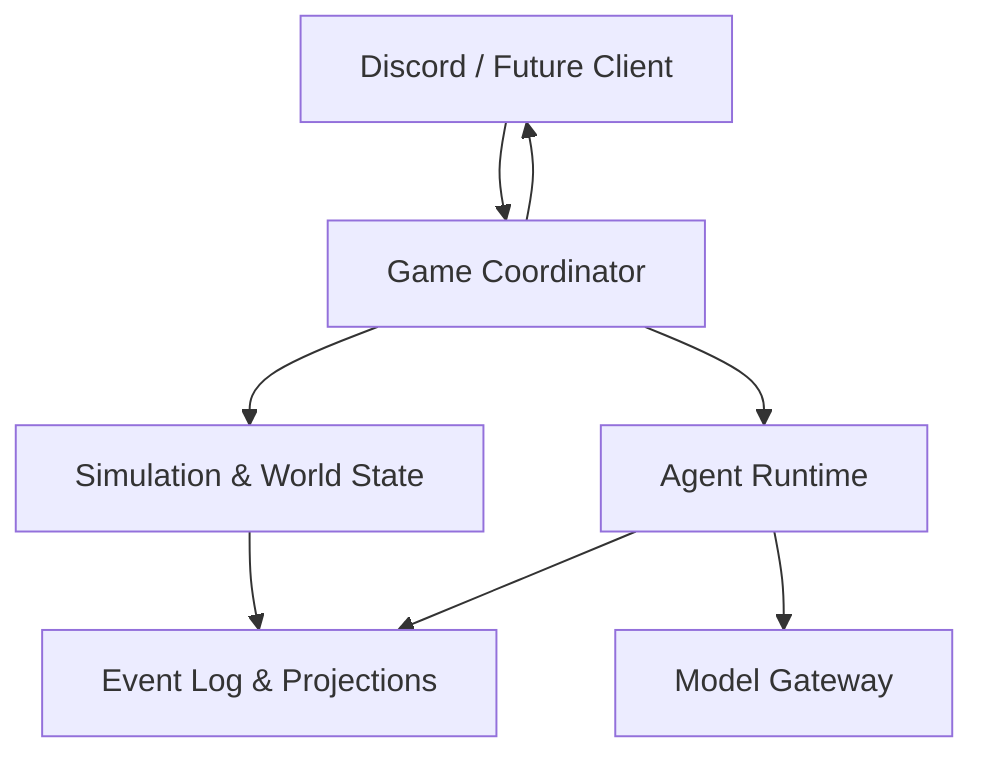
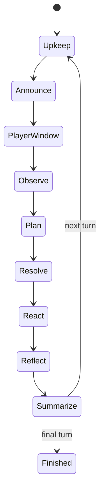

# 初始系统架构

> 状态：Draft  
> 范围：Discord Vertical Slice  
> 架构目标：用最少的基础设施验证玩法，同时让核心模拟未来可接入网页或图形化游戏引擎。

## 1. 架构决策摘要

首版采用 **TypeScript 模块化单体（modular monolith）+ SQLite + 追加式事件日志**。

暂不拆分微服务，原因是：

- 只有一个 Discord 世界和少量 NPC；
- 回合制调度不需要分布式并发；
- 世界一致性和可重放性比独立扩缩容更重要；
- 模块边界仍可在未来拆成 Agent Service、Simulation Service 和 Game Client。

Discord 不是权威数据源，LLM 也不是权威数据源。权威状态只存在于 World State 和已经提交的 Domain Event 中。

## 2. 核心原则

1. **World-authoritative**：位置、资源、关系、健康和结局只能由领域规则修改。
2. **Agent proposes, engine disposes**：Agent 提交 Action Intent，Validator 和 Resolver 决定是否成功。
3. **Subjective knowledge**：NPC 只能基于自己的 Observation、Belief 和 Memory 决策。
4. **Event-driven**：已结算结果以不可变事件记录，当前状态由事件投影得到。
5. **Replayable**：重放使用已保存的 Agent 输出，不再次调用模型。
6. **Bounded autonomy**：每个 Agent 有独立状态和目标，但只在调度器允许时运行。
7. **Graceful degradation**：模型超时或格式错误不能阻塞游戏。
8. **Content as data**：NPC、地点、主线事件、物品、配方和动作规则以配置定义，不硬编码在 Discord Bot 中。
9. **Resource conservation**：采集、预留、生产、运输和消费必须保持库存守恒，禁止负库存和重复消耗。

## 3. 上下文架构



### 3.1 Discord Adapter

职责：

- 接收玩家消息和 slash command；
- 将 Discord Channel ID 映射为 Location ID；
- 通过 Webhook 使用 NPC 姓名和头像发言；
- 渲染广播、对话、行动结果和回合总结；
- 对外部消息做去重、长度限制和 mention 清理；
- 将发送任务排队并处理限流。

不负责：

- 判断动作是否合法；
- 保存 NPC 记忆；
- 修改资源和关系；
- 决定主线结果。

### 3.2 Game Coordinator

职责：

- 创建、暂停、恢复和结束 Game Session；
- 驱动回合状态机；
- 构造统一的回合 Observation Snapshot；
- 调度 Agent 规划、反应和反思；
- 将 Action Intent 交给 Simulation；
- 控制调用预算、超时和 fallback；
- 触发 Discord 渲染。

Coordinator 是用例编排层，不包含具体动作规则。

### 3.3 Simulation

职责：

- 维护 World State；
- 校验动作前置条件；
- 解决多个动作的资源或目标冲突；
- 生成确定性的 Domain Event；
- 更新位置、个人生存状态、库存、设施、关系和场景 flag；
- 处理资源节点、物品预留、配方生产和建设项目；
- 判断生存路线是否已满足；
- 结算最终结局。

Simulation 不生成自然语言，也不读取 Discord 历史。

### 3.4 Agent Runtime

职责：

- 读取 NPC Profile、Goal、Belief、Relationship 和 Memory；
- 根据当前世界事件生成该 NPC 可见的 Observation；
- 检索相关记忆；
- 调用模型生成结构化 Action Intent；
- 生成有限的对话内容；
- 在重要事件后写入主观记忆；
- 按阈值进行反思和信念更新。

不同 NPC 共享同一套 Runtime 实现，但拥有隔离的状态、命名空间和调用上下文。独立 Agent 不等于独立进程或独立模型实例。

### 3.5 Model Gateway

职责：

- 屏蔽模型供应商差异；
- 执行结构化输出校验；
- 设置超时、重试和 token 上限；
- 记录模型、延迟、使用量和失败类型；
- 支持测试时的 Fake Model；
- 支持按任务选择不同模型等级。

Model Gateway 不知道 Discord，也不能直接访问数据库仓储。

### 3.6 Storage

首版使用 SQLite，包含：

- 追加式 Domain Event；
- 当前 World Projection；
- NPC Profile、Goal、Belief、Relationship；
- 主观 Memory；
- Agent Decision；
- Discord Message Binding；
- Scenario Definition Version；
- Model Call Trace。

## 4. 推荐代码结构

```text
apps/
  discord-bot/
    src/
      commands/
      events/
      rendering/
      webhooks/

packages/
  domain/
    src/
      entities/
      events/
      actions/
      inventory/
      production/
      survival/
      policies/
      schemas/

  simulation/
    src/
      coordinator/
      scheduler/
      validation/
      resolution/
      inventory/
      production/
      survival/
      projection/
      endings/

  agents/
    src/
      perception/
      planning/
      dialogue/
      memory/
      reflection/
      fallback/

  model-gateway/
    src/
      providers/
      structured-output/
      retry/
      telemetry/

  storage/
    src/
      sqlite/
      repositories/
      migrations/

  scenarios/
    ahsarah/
      scenario.yaml
      locations.yaml
      actions.yaml
      items.yaml
      recipes.yaml
      resource-nodes.yaml
      stations.yaml
      npcs/
      events/
      endings/

  observability/
    src/
      logging/
      replay/
      metrics/

docs/
  game-design/
  architecture/
  decisions/
```

首版可以放在一个 workspace 中运行，但 domain 包不得依赖 Discord SDK 或模型 SDK。

## 5. 核心领域模型

### 5.1 GameSession

```text
GameSession
  id
  scenarioVersion
  status
  currentTurn
  phase
  randomSeed
  modelBudget
  startedAt
  endedAt
```

### 5.2 WorldState

```text
WorldState
  clock
  stormEta
  locations
  characters
  inventories
  resourceNodes
  productionStations
  activeProjects
  scenarioFlags
  activeThreats
  availableEndings
```

### 5.3 NPCState

```text
NPCState
  npcId
  locationId
  traits
  values
  needs
  skills
  currentGoals
  beliefs
  relationships
  inventory
  equipment
  survival
    hydration
    satiety
    energy
    health
  currentPlan
  status
```

### 5.4 物品、资源和生产

```text
ItemDefinition
  itemId
  category
  unitWeight
  stackLimit
  consumableEffects
  tags

ItemStack
  itemId
  quantity
  ownerType
  ownerId
  visibility
  reservedQuantity

ResourceNode
  nodeId
  locationId
  itemId
  remainingQuantity
  regenerationPolicy
  hazard

RecipeDefinition
  recipeId
  inputItems
  outputItems
  stationType
  requiredSkill
  energyCost

ProductionJob
  jobId
  actorId
  recipeId
  stationId
  inputReservations
  intendedRecipients
  status
```

库存、Reservation、配方输入和输出均由 Simulation 原子结算。详细规则见[生存、采集与生产系统](../game-design/survival-production-system.md)。

### 5.5 Memory

```text
Memory
  memoryId
  ownerNpcId
  sourceEventId
  type
  content
  participants
  locationId
  observedAt
  importance
  emotionalValence
  confidence
  visibility
```

Memory 是 NPC 的主观记录，不是权威事实。它可以不完整、过时或错误。

### 5.6 ActionIntent

```json
{
  "actorId": "tariq",
  "turn": 2,
  "type": "repair",
  "targetId": "mother-well-pump",
  "parameters": {
    "requestedHelpers": ["layla"]
  },
  "speech": {
    "audience": "location",
    "text": "水房需要更多工具，否则今天无法完成检查。"
  },
  "reasonSummary": "恢复供水比救援商队更紧急",
  "confidence": 0.78
}
```

`reasonSummary` 仅用于调试和评估，不应显示给玩家，也不参与规则结算。

### 5.7 DomainEvent

```text
DomainEvent
  eventId
  sessionId
  turn
  phase
  type
  actorId
  targetIds
  locationId
  payload
  visibility
  causationId
  correlationId
  occurredAt
```

建议事件示例：

- `TurnStarted`
- `WorldEventAnnounced`
- `NpcMoved`
- `MessageSpoken`
- `ActionRejected`
- `RepairProgressed`
- `ResourceCollected`
- `ResourceNodeDepleted`
- `ItemReserved`
- `ReservationReleased`
- `ItemTransferred`
- `ItemConsumed`
- `ItemCrafted`
- `SurvivalNeedChanged`
- `CharacterBecameCritical`
- `ProjectProgressed`
- `NpcObservedEvent`
- `BeliefChanged`
- `RelationshipChanged`
- `LocationUnlocked`
- `SurvivalPlanActivated`
- `EndingResolved`

## 6. 回合状态机



### 6.1 Upkeep

根据天气、地点、装备和上一回合行动，确定性结算 Hydration、Satiety、Energy、Health、疾病与持续设施效果。Upkeep 只产生状态事件，不允许自动消费未被角色预留的公共或私人库存。

### 6.2 Announce

Scenario Director 根据回合数和当前 flag 选择外部事件，产生 `WorldEventAnnounced`。

### 6.3 PlayerWindow

接受玩家本回合允许的广播、地点交互和直接请求。玩家文本先转换成 Message Event，不直接改变世界事实。

### 6.4 Observe

为每个 NPC 构造隔离的 Observation：

- 全城广播；
- 当前地点事件；
- 直接消息；
- 自己的 Survival State；
- 当前可感知角色、物品、资源节点和生产设施；
- 已知库存、配方、生产承诺和建设需求；
- 与当前局势相关的记忆；
- NPC 已知的合法动作类型。

### 6.5 Plan

所有 NPC 基于同一阶段开始时的 Snapshot 提交主要 Action Intent，避免先运行的 NPC 获得不公平的信息优势。

### 6.6 Resolve

Resolver 按规则解决冲突：

1. 校验 actor 状态和位置；
2. 校验目标是否存在；
3. 校验技能、体力、配方、设施、物品和时间；
4. 原子预留输入物品和设施容量；
5. 处理同一资源节点、库存或设施的竞争；
6. 消耗已预留输入，并使用固定规则和 session seed 处理产量或失败；
7. 产生输出物品与 Domain Event；
8. 释放未使用的 Reservation；
9. 原子提交事件和 Projection。

动作优先级必须由规则定义，不能取决于异步模型调用完成顺序。

### 6.7 React

只允许由重大结果触发一次有限反应，例如逃跑、拒绝交易、紧急治疗。首版限制最大反应深度为 1，避免 Agent 相互触发形成无限循环。

### 6.8 Reflect

只有满足条件时才调用：

- 高重要度事件；
- 关系发生显著变化；
- 当前计划失败；
- 每两个回合的周期性总结；
- 最终回合。

### 6.9 Summarize

世界引擎生成结构化公共结果，再由模板或模型润色成广播。总结只能描述已发生的事件。

## 7. 感知和信息隔离


Visibility Policy 至少支持：

- `public`：所有 NPC；
- `location`：事件发生地点的可感知 NPC；
- `direct`：明确接收者；
- `private`：仅 actor 自己；
- `hidden`：不直接进入任何 NPC 认知；
- `developer`：仅调试日志。

NPC 不应查询完整 WorldState。Agent Runtime 只能接收 Perception Service 生成的 DTO。

玩家说出的内容作为“某人声称某事”的事件保存。只有通过调查或权威事件确认后，它才可能成为高置信度 Belief。

## 8. 记忆与关系

### 8.1 记忆分类

- **Working**：当前回合和最近对话；
- **Episodic**：发生过的具体事件；
- **Semantic**：NPC 从多个事件总结出的观点；
- **Commitment**：承诺、交易和债务；
- **Social**：关于其他角色的评价和传闻。

### 8.2 检索排序

首版采用可解释评分：

```text
score =
  relevance * 0.45 +
  importance * 0.30 +
  recency * 0.15 +
  relationshipRelevance * 0.10
```

向量检索不是首版前置条件。6 个 NPC、6 个回合可以先用结构化 tag、参与者和文本相似度完成检索。

### 8.3 关系

每对角色至少保存：

- trust；
- affection；
- fear；
- respect；
- obligation。

关系变化只能由可追溯事件触发，例如履行承诺、被欺骗或得到救助。

## 9. 动作校验和结果

每种动作以配置或代码策略定义：

```text
ActionDefinition
  type
  allowedTargets
  requiredLocation
  requiredSkills
  requiredItems
  requiredStation
  recipeId
  resourceCost
  energyCost
  duration
  visibility
  successPolicy
  emittedEvents
  fallback
```

必须区分：

- **Invalid**：逻辑上不可能，不消耗行动或进入明确 fallback；
- **Failed**：合法尝试但结果失败，仍产生事件和后果；
- **Succeeded**：满足规则并产生预期事件；
- **PartiallySucceeded**：只完成部分进度。

模型不能通过自然语言宣告成功。

采集和生产还必须区分 Item Stack 所有权、可见性、可携带量与 reservedQuantity。同一回合新采集的物品默认在结算后才可用于后续生产，避免形成无限生产链。

## 10. Scenario Director

Scenario Director 负责外部世界压力，不控制 NPC，也不强迫剧情走向固定结局。

事件定义建议包含：

```yaml
id: underground-rumble
available_from_turn: 4
conditions:
  all:
    - flag: night_sea_opened
      equals: false
effects:
  - type: location_clue_revealed
    location: mother-well
visibility: public
variants:
  - when:
      flag: well_inspected
      equals: true
    text_key: rumble_after_investigation
```

所有内容配置都带 `scenarioVersion`，保证旧存档和重放仍能找到原始规则。

## 11. 模型调用预算

6 NPC × 6 回合的目标预算：

| 调用类型 | 最大建议 |
| --- | ---: |
| 每回合主要规划 | 36 |
| 重大事件反应 | 12 |
| 周期或结局反思 | 12 |
| 总计 | 60 |

普通移动、规则反应、模板广播和无变化回合不调用模型。

单次调用必须设置：

- 明确任务类型；
- 结构化 schema；
- 最大输入记忆数；
- 超时；
- 至多一次格式修复重试；
- fallback 行为。

## 12. Fallback 策略

当模型超时、限流或输出无效时：

1. 如果 NPC 有仍然有效的 currentPlan，继续计划；
2. 否则根据 Needs、Goal 和可用动作使用 Utility Policy；
3. 若没有积极动作，执行 `wait` 或 `rest`；
4. 记录 `AgentFallbackUsed`；
5. 不向玩家暴露原始模型错误。

模型故障不能导致回合无法结束。

## 13. 可观测性与重放

每次 Agent 决策记录：

- Observation 摘要和可见 event ID；
- 检索到的 memory ID；
- prompt/template version；
- model identifier；
- 原始结构化输出；
- schema 校验结果；
- 最终 Action Intent；
- Validator 结果；
- 产生的 Domain Event；
- 延迟和用量。

Replay Mode 不调用模型，而是依次读取已保存的 Action Intent 和 Domain Event，验证 Projection hash。

需要支持导出单局报告：

- 世界状态时间线；
- 每个 NPC 的行动轨迹；
- 信息传播路径；
- 关系变化；
- 模型调用和失败；
- 结局及其因果链。

## 14. 测试策略

### Domain Unit Tests

- 动作前置条件；
- 库存守恒、容量和所有权；
- 并发预留不会重复消耗；
- 配方输入输出和设施容量；
- Survival Upkeep 与阈值效果；
- 位置与可见性；
- 关系更新；
- 生存路线条件；
- 结局计算。

### Simulation Tests

- 6 回合可以无模型运行；
- 同一 seed 和已保存 Intent 可重放到同一 Projection hash；
- 并发提交顺序不改变结算；
- 非法动作无法修改世界；
- 相同 seed 可重放到相同库存和 Survival State；
- 采集、生产、消费和运输都可追溯到事件。

### Agent Contract Tests

- 输出符合 schema；
- Observation 不泄露隐藏事件；
- 无模型时 fallback 可用；
- prompt version 可追踪。

### End-to-End Tests

- Discord 消息映射到正确 session 和 location；
- Webhook NPC 身份渲染正确；
- 回合可以暂停和恢复；
- 重复 Discord event 不会重复结算。

## 15. 从 Discord 到开放世界

未来接入游戏引擎时：

- 保留 domain、simulation、agents、storage 和 scenario；
- 用 Game Engine Adapter 替换或并行 Discord Adapter；
- 将回合动作映射为实时任务和动画；
- 对附近 NPC 使用高频行为树，对远处 NPC 使用当前低频 Agent 模拟；
- 世界引擎仍负责权威状态和动作校验；
- Discord 可以继续作为观察、运营或异步事件入口。

因此，首版并不是一次性 Discord Bot，而是开放世界 Agent Simulation 的最小客户端。
